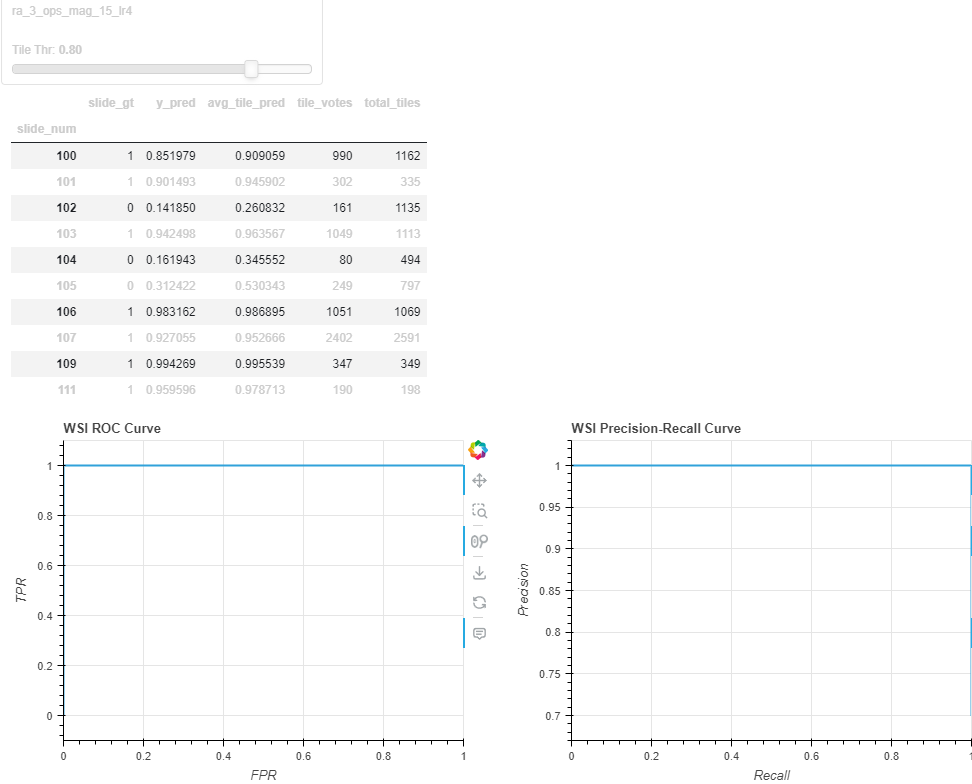

# Part I:
    - Goal: Train a classifier to predict wsi class

## Solution:

### High level:
- open slides and divide into tiles in the highest resolution, remove tiles with no data at all.  
- preform some preprocess on the tile to adjust to common slides issue (e.g. pen marking) - TODO: Explain  
- split the **tiles** dataset and run classification models.
- experiment with different data filters augmentation, architectures, hyperparams as much as possible.
- measure model performance on the tiles dataset, and create an aggregation for slides classification.

Some of the described steps were implemented naively due to time constraints.

### Data & More:
I used data from TUPAC16 challenge [here](https://tupac.grand-challenge.org/TUPAC/)  
I also used and influenced from other github repositories I found working on that challenge in previous year [deep-histopath](https://github.com/CODAIT/deep-histopath/tree/master)  
I read through the abstract of a few related paper to get some ideas.

### Detailed Steps:
  1. **slide to tiles**: using openslide I've cut the input WSI into tiles of 1024 x 1024 in their maximal resolution (all images were X40 magnification)
  2. **preprocess**: I've used minimal preprocess in order to keep the features extraction for the model. I've used the deep-histopath github repo. Preprocessed included computation of images score and tissue_percentage per tile. This ensures we use only tiles with actual tissue.  
  Tissues percentage takes into account the common use of red / green pen on top of the slides and also the white background to be filtered out. 
  Image score takes into account image color space (should be red-pink) and 1st order statistics that should be significant in tissue samples.
  3. **dataset**: I've built the dataset based on these utilities in jupyter notebook, I've created 3 tiles dataset. Each dataset is described by Tiles DataFrame, where during runtime the `pd.Series` describing the tile is being constructed to Tile object and image is created on the fly.
     1. train-val: datasets were saved in different `.pickle` files, but created together. classification was done on a slide level (70% label 1) and inferred to the tiles creating each slide. The train-val split was done randomly on the tiles (70% train image). This is not the best way to split train-val because it causes leakage from train -> val
     2. test: I've added another 3 images (~ 3 GB) ~ balanced to measure performance because I was concerned of overfitting due to the fact that the label do not represent anything, and from the data leakage.  

    Tiles dataset can be meaningless in real world scenarios where the slide can be classified positive but not all tile in itself is positive. Still the choice helped me measure and iterate more easily.

  1. **training**: I've built my code on top of pythorch lightning with support of hydra to manage my configuration.  
  - class imbalance in the slides, I tried several approaches and decided to implement a `Sampler` to make each batch class balanced - this resulted in slightly less data for train.
  - architecture, because cell are spatially related, I did not see a big advantage in Transformer architectures and experimented mainly with Resnet
  - first experiments showed high overfitting of the data (both train and val) - I tried to use "strong" augmentation including color augmentation. Mainly I used the [RandAugment](https://arxiv.org/pdf/1909.13719)
  1. **evaluation**:  Iteratively experiment with different configuration based on collected metrics. Not all experiments are shown, each step tried to solve the current issue.  
  Used metrics included, loss and accuracy collect during training (TensorBoard) and Precision-Recall & ROC Curves as well as confusion matrix computed after the training has completed.

## Results:

### EDA
Tissue percentage level for each slide

### Performance evaluation  - FIXME

Overfitting:
we can see that models tend to over fit the train data And that the validation set is not really independent, Thus I Tried to use more heavier augmentations, which is viable in the last 2 models (train accuracy is not perfect)

Tensor Board Train         |  Tensor Board Validation
:-------------------------:|:-------------------------:
  |  

We can see the loss plateaus for most models except the last 2, as but the loss in validation is much more stable for those models.

Tile Dataset Performance:
Looking on the best checkpoint for all the above models gives a very good impression (consistent with accuracy metrics)

*confusion matrix is computed tor cutoff in 0.9 which represent the "knee" in the Precision-Recall plot.

Test Set: 
These result seems too good to be true, so I tested on an independent test set

Where the `baseline` model is totally wrong, and all other models are around 50-50  
Looking on the confusion matrix, we can see our main issue in FN (with respect to the total population)
But with respect to the population we are slightly better than random (TPR=0.55, FPR=0.44 @thr=0.93 - Middle of the ROC plot)

Although the result our about random this aligned with my assumption due to the nature of the random samples and small dataset.

Slides Result:
For the WSI classifier I've aggregated all the tiles, first by averaging the prediction score over all tiles and second (and I think better) by majority voting, counting all tiles after hard threshold

when choosing tile thr of 0.9 we can see we get a perfect classification when the slide thr ~= 0.5 (there is a gap of 0.08: 0.49-0.57). tile thr of 0.9 was choosen due to the previous result different choice will give a slightly different working point in the WSI classifier. We can see that there is only a minor difference on thr avg score on slide 110, 114

For completeness attached also the slide metrics on the validation set

which are much more consistent (as seen in the table)

## Future work / Issues
 1. ~~class imbalance - Experimented with infinte random dataloader, Slide dtaaloadt and Best option was to sample evenly using the dataloader~~
 2. Normalization - I started with ImageNet values - I calculated the RGB $`\mu,  \sigma `$ to replace them.
 3. Data filtering - I used only samples with `tissue_percentage > 0` I considered using the image score or take higher tissue percentage for training purpose.
 4. Use randomly selected crops instead of predefined crops, This can be combined with multiple resolution choice (similar to augmentation, assumes not all cells are the same size)
 5. calibrate the model scores sot that the best working point will be at 0.5 (It's a bit weird to have such working point after the balanced sampling)

## Examples

Green indicate high tissue tiles red indicate No tissue tiles

Tiles examples:
TR-102                     |       TR-106              |        TR-107
:-------------------------:|:-------------------------:|:-------------------------:
  |   |  

