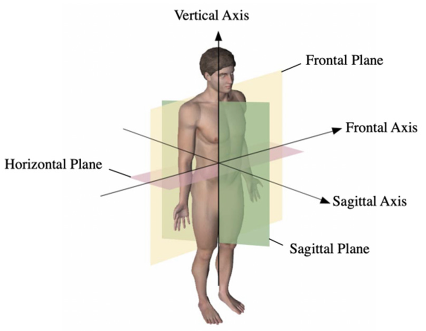
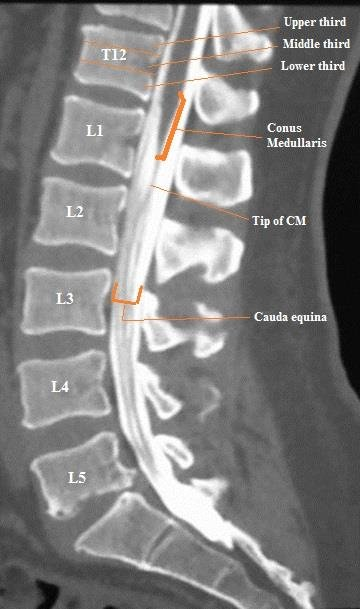
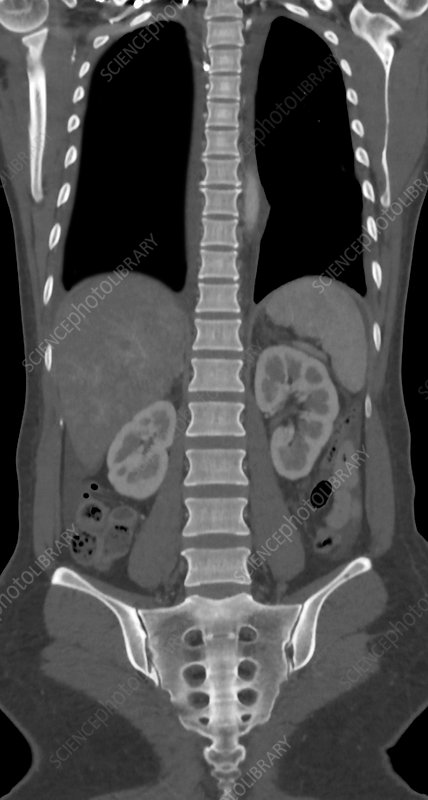
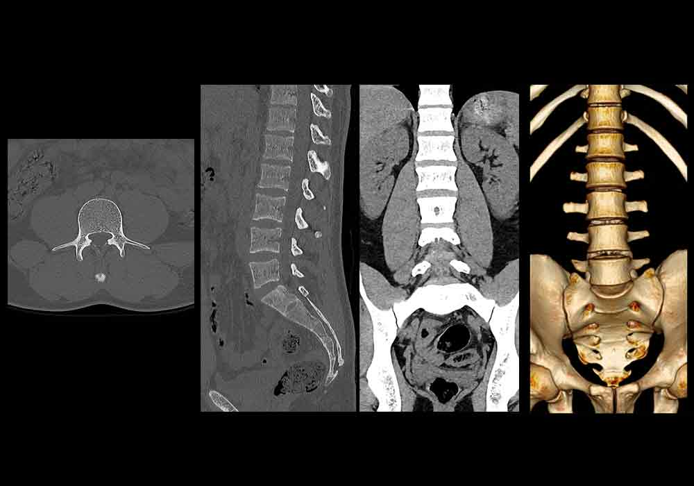
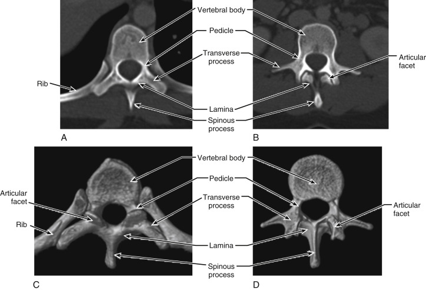

# Part II:
    - Goal: Describe 2 approaches to find the L3 from CT scan

## General (assumptions)
I'm not sure how does dcm files look like.  
I Imagine it as a series of images (slices) of the body aligned by the vertical axis (each slice is a Horizontal plane)  
- From what I know about CT, it's actually a 3d volume described by voxel representation, so in practice there is a way to rotate the scan to the required axis.

<!-- {width: "200px" height:"150px"} -->

## Approach A: Classical
- Identify vertebrae in each horizontal plane image (slice) by finding the largest “blob”
    - Using morphology operations on binary image should take the largest bone in the image
    - specificaly we can use `cv2.findCountours` as an easy method
- Measure IoU between 2 adjacent slices to make sure they are from the section(vertebrae)
    - They should be aligned and the size different between adjacent slices should be small
    - the intervertebral  disc should create area of discontinuity effectively separating between the vertebras
- To find the specific L3, we need to start from a known "anchor" and count up
    - The Sacrum should be identified easily because it’s the lowest and the largest bone in the scan
    - Count 3 vertebrae to reach L3
    - For the middle section take half point from the start and end of the vertebrae
### simpler version: 
    In case we are not bounded to vertical slice (dcm files)
    We can identify L3 by counting vertebrae front to the spinal coord from a side view,
    we can find the Z-plane and choose the correct slice

    

## Approach B: Data Driven
- Assume we know nothing, We can use radiologist to annotate the slices
- For the simplest option (yet not sure it will work) classify each slice
    - Is is L3 or not
- This assumes that L3 slices are identified with no context of other joints
    - (need to ask domain experts)
- Extension:
    - Use 3D architectures (use voxels instead pixels) - this can work similar to pose estimation networks where we actually predict different heatmaps for each vertebrae
    - again if we do not assume we need to work by slices (dcm files), we can use a frontal view and annotate vertebrates on the same image

# Reference Images

